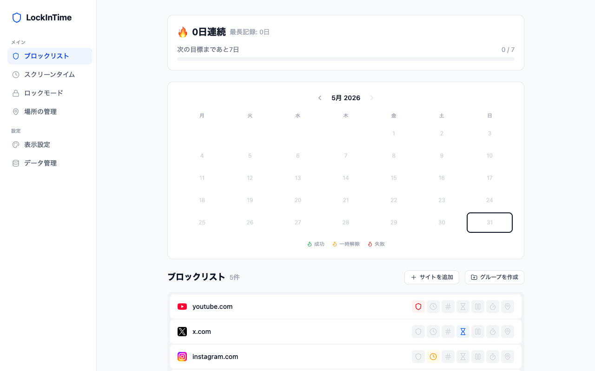
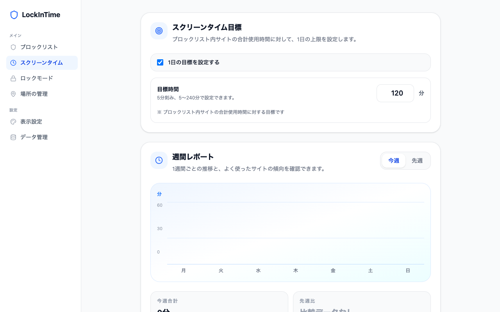
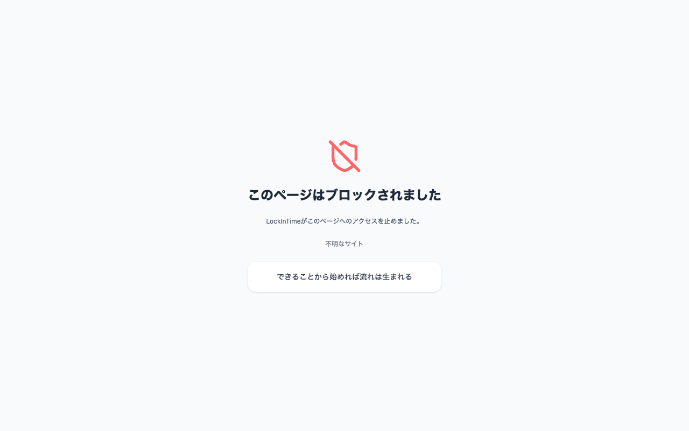
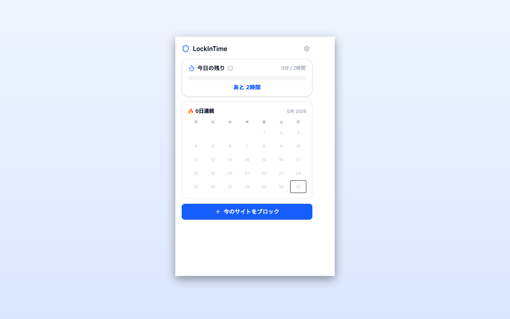

<div align="center">


# LockInTime

**集中したい時間を、守る。** — 日本語特化のサイトブロッカー＆スクリーンタイム管理 Chrome 拡張機能


</div>

---

## 概要

LockInTime は、「ついつい見てしまう」サイトをブロックして集中時間を確保し、PC のスクリーンタイムを可視化する Chrome 拡張機能（Manifest V3）です。スマホには標準のスクリーンタイム機能がある一方で、**PC では使いすぎの把握・制御がしづらい**という課題に着目して開発しました。

7 種類の制限方式・位置情報ベースのルール・ストリーク（継続日数）による習慣化支援など、「ただブロックするだけ」で終わらない設計が特徴です。

> 🛠 個人開発 / 企画・設計・実装・テストまで一人で担当

## スクリーンショット

| ブロックリスト（ダッシュボード） | スクリーンタイム |
|:---:|:---:|
|  |  |
| **ブロック画面** | **ポップアップ** |
|  |  |

## 主な機能

- **7 種類の制限方式** — 用途に応じてサイトごとに使い分け
  - `full_block` 完全ブロック / `time_of_day` 時間帯 / `daily_count` 1日の回数 / `daily_duration` 1日の利用時間 / `cooldown` クールダウン / `delay` 遅延ゲート / `location` 位置情報
- **スクリーンタイム計測** — 全サイトの利用時間を計測し、1日の目標と週間レポートで可視化
- **位置情報ルール** — 「会社にいるときだけブロック」など、現在地に応じた制御（座標は端末内処理のみ）
- **ストリーク & マイルストーン** — 継続日数を記録し、習慣化を後押し
- **ロックモード** — 設定を勝手に解除できないようにする自己拘束機能

## 技術スタック

| 領域 | 使用技術 |
|---|---|
| フロントエンド | React 19, TypeScript 5.9（strict）, Tailwind CSS 4, Vite 8 |
| 拡張機能基盤 | Manifest V3, Service Worker, Declarative Net Request (DNR) |
| バックエンド | Firebase（Auth / Firestore / Cloud Functions） |
| 決済 | Stripe |
| テスト | Vitest（ロジック層を TDD で実装） |

## アーキテクチャの要点

- **Manifest V3 / Service Worker ベース** — 永続バックグラウンドを持たない制約下で、`alarms` による時刻ベースのルール評価とスケジューリングを実装
- **Declarative Net Request によるブロック** — ページ内容を読み取らず、宣言的ルールでブロック／リダイレクトを実現（プライバシーと性能を両立）
- **型付きスナップショットマージ同期** — Chrome local storage と Firestore を、型安全なマージ戦略で双方向同期
- ** wall-clock モデルのセッション管理** — `daily_count` の「1回あたり◯分」セッションを実時間ベースで管理し、Service Worker のスリープをまたいでも正しく計測
- **ロジックとUIの分離** — コアロジック（`src/lib`）は UI から独立させ、TDD（Vitest）で検証

## ディレクトリ構成

```
src/
  background/   # Service Worker（ルールエンジン・スケジューラ・同期）
  popup/        # ポップアップ UI
  options/      # 設定ページ + オンボーディング
  blocked/      # ブロックページ
  content/      # Content Script（遅延ゲート・スクリーンタイム計測）
  components/   # 共有 UI コンポーネント
  lib/          # コアロジック（types / storage / rules / sync / location 等）
functions/      # Firebase Cloud Functions（Stripe 連携）
infra/          # Firestore ルール・インデックス
public/         # manifest.json / アイコン / _locales (ja, en)
```

## 開発

```bash
npm install
npm run dev            # 開発ビルド（Vite）
npm run build          # tsc --noEmit && vite build
npm test               # Vitest（拡張機能側）
npm run test:functions # Cloud Functions テスト
npm run test:all       # 全テスト
```

ロジック層は **テスト駆動開発（TDD）** で実装。`src/**/__tests__/` に 30 のテストファイルを配置しています。

## プライバシー

ブロック設定・スクリーンタイム・ストリークなどのデータは、原則すべて端末内（`chrome.storage.local`）に保存され、外部に送信されません。位置情報も端末内のルール判定にのみ使用し、送信しません。詳細は [プライバシーポリシー](https://onki75.github.io/lockintime-site/privacy/) を参照。

---

<div align="center">
<sub>個人開発プロジェクト — 企画・設計・実装・テスト</sub>
</div>
